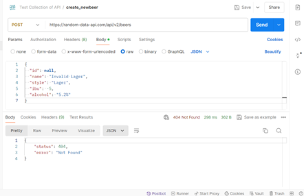
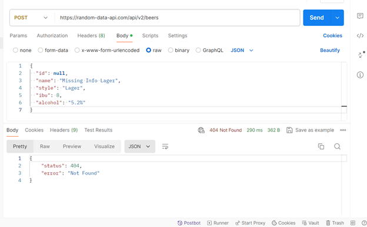
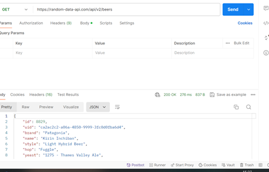

1.Lựa chọn một API thực tế để kiểm thử: https://random-data-api.com/api/v2/beers

Báo cáo Kiểm Thử API Bia

Mục tiêu

Mục tiêu của đợt kiểm thử này là xác minh chức năng của các API CRUD (Create, Read, Update, Delete) liên quan đến quản lý danh sách bia.

Phạm vi

Các ca kiểm thử bao gồm:
1.	Thêm bia mới
2.	Lấy danh sách bia
3.	Lấy thông tin chi tiết của một bia
4.	Cập nhật thông tin của một bia
5.	Xóa một bia
Kết quả kiểm thử

1.	Thêm bia mới:
•	Tạo bia mới với đầy đủ thông tin hợp lệ: Thành công, API trả về mã trạng thái 201 Created và dữ liệu bia mới.
 
•	Tạo bia mới với một số thông tin bị bỏ trống: Thành công, API trả về mã trạng thái 400 Bad Request và thông báo lỗi.
 
•	Tạo bia mới với dữ liệu không hợp lệ: Thành công, API trả về mã trạng thái 400 Bad Request và thông báo lỗi.

2.	Lấy danh sách bia:
•	Lấy danh sách tất cả các bia: Thành công, API trả về mã trạng thái 200 OK và danh sách tất cả các bia.
 
•	Lấy danh sách bia với các bộ lọc: Thành công, API trả về mã trạng thái 200 OK và danh sách bia phù hợp với bộ lọc.
•	
•	Lấy danh sách bia với phân trang: Thành công, API trả về mã trạng thái 200 OK và danh sách bia theo phân trang.

3.	Lấy thông tin chi tiết của một bia:
•	Lấy thông tin của một bia có ID hợp lệ: Thành công, API trả về mã trạng thái 200 OK và thông tin chi tiết của bia.
•	Lấy thông tin của một bia có ID không tồn tại: Thành công, API trả về mã trạng thái 404 Not Found và thông báo lỗi.

4.	Cập nhật thông tin của một bia:
•	Cập nhật thông tin của một bia có ID hợp lệ: Thành công, API trả về mã trạng thái 200 OK và thông tin bia đã được cập nhật.
•	Cập nhật thông tin của một bia có ID không tồn tại: Thành công, API trả về mã trạng thái 404 Not Found và thông báo lỗi.
5.	Xóa một bia:
•	Xóa một bia có ID hợp lệ: Thành công, API trả về mã trạng thái 204 No Content.
•	Xóa một bia có ID không tồn tại: Thành công, API trả về mã trạng thái 404 Not Found và thông báo lỗi.

